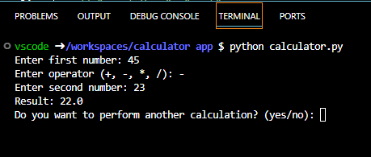
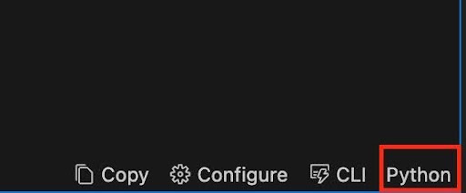

# Running Runme in a DevContainer

## Introduction

In the development process, the goal extends beyond having working and scalable software but simplifying routine tasks to reduce complexity.

For engineers, the solution would be to document processes for handling incidents and automating everyday operations. As organizations seek to replace manual processes with executable code, runbooks have become more essential.

[Runme](https://runme.dev/) is a tool that lets you run step-by-step processes, both manually and automatically, making it easier to handle and automate tasks. It's like a one-stop solution to speed up your development and operation processes.

In this, we will give you a step-by-step guide on how to integrate Dev Container into your Runme and perform awesome actions.

At the end of this guide you will learn how to:

- Setup Runme in your code editor, Vscode
- Configure Runme in your devcontainer to running development task
- Automate operations documents.

## **Creating your development container**

A development container, also referred to as a ‘dev container’ is a dockerized container that allows you to run your software in a fully configured development environment, which significantly speeds up application deployment and scalability.

Dev containers are highly preferred as it enables developers to run programs without the need to configure anything and with zero setup required.

For this guide, we will be using an already existing Python app. Feel free to use any application of your choice.

1. Install Visual Studio Code

If you haven’t installed this yet you should [install it now](https://code.visualstudio.com/).

2. Install the Dev Containers extension ( formerly called *Remote- Container extension*)

In your VS Code, navigate to the extension view by clicking on the **Extensions Icon** in the Activity bar on the side of the window. Search for **Dev Containers**  and install the extension.


3. In your Vs code project, create a Dev Container Configuration

On the bottom left of your Code editot, click the **Remote container** icon.


- When prompted on the new view that gets displayed, click on **Reopen in Container**.
- A new view will open to enable you to add dev container configuration files.
- In this view, search for your specified programming language and also add additional features you wish to install.
- Click **OK** to proceed.

Your system will first add dev container configuration files and start the dev container.

Once these steps are complete, your .devcontainer directory, devcontainer.json and .github directory will be created as displayed in the image below.


4. Run Your App:

Depending on the programming language of your script, run your app in the terminal. This guide uses a Python app named calculator.py so we will run the following command

```bash {"id":"01HPF5MXD3HBWB5T32AAF6S9JF"}

python calculator.py

```

This will execute your Python app within the dev container.



**Note:**

1. Ensure Docker is open and running on your system before you create a dev container.
2. You do not need to create a separate dockerfile for this as the base image and settings needed for your development environment are specified in the dev container configuration (devcontainer.json). This eliminates the need for explicit Dockerfile maintenance and makes it simple to share and replicate the development environment across several machines.

## **Setting up Runme on VSCode**

Installing Runme in your VS Code is one of the various ways you can utilize the awesome features of Runme. To set up Runme on VS Code, follow our [installation guide.](https://docs.runme.dev/install#runme-for-vs-code)

## **Running development tasks using Runme within your container**

Runme works perfectly  to automate processes and conduct development operations within the container . To run your code with Runme in your dev container, follow the steps below:

- Create and open your **READ.me** file in your VScode.
- Click on the **+Code** icon and type in your code script.
- Click on the **Remote Container** icon on the bottom left of your VS code.


Now a new view opens that prompts you to select and open a remote window.

- Click on **Dev container** or **Add dev container configuration files**
- Choose a dev container configuration based on your programming language. This guide uses a Python app, so the Python dev container will be used.
- Now choose the version you want and add any other features you want to install.
- Now click **OK**. Your container configuration gets added, and the container starts.

You will notice that your READ.me file switches over to a normal markdown setting. You will need to take it back to a Runme setting to enable you to run your code with Runme in a dev container. To do this,

- Go to the extensions page and search for Runme.
- Click on the Runme extension and click on the **Install in Dev container**


- Once it is installed, go back to your READ.me file, and you will see your code in Runme format.
- Click on **Select Cell Language Mode** and configure it to the programming language of your script.



- Now click the **Run** icon and view your output on the Runme terminal.


## **Other Features**

Some other actions that can be performed in your Dev container include cloning repository, configuring container features, exploring a volume, etc. The image below shows you a non-exhaustive list of some of these actions.


## **Conclusion**

In this guide, we demonstrated how to create a dev container, set up Runme on VS Code, run development tasks using Runme within your container.

The development process is made more effective by the ability to automate processes and conduct development operations within the container using Runme.

By following the steps outlined in the guide, developers can greatly improve their workflow and concentrate more on creating scalable and effective software.
