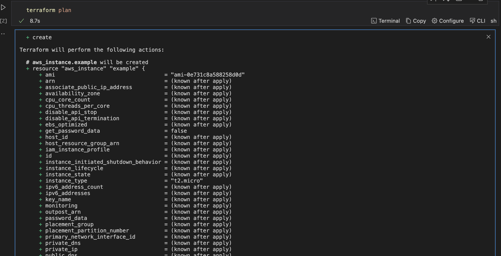
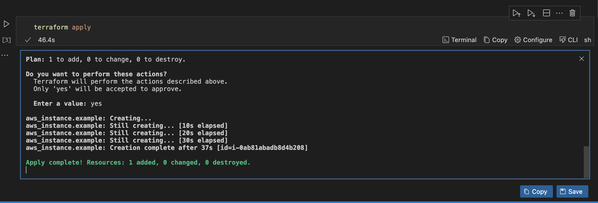

# Terraform via Runme

This is a toturial guide that helps us in setting up Terraform to create an EC2 instance is a straightforward process that involves defining your infrastructure as code. In this article, we'll walk through the steps to set up Terraform and create an EC2 instance on AWS.

## **Why Combine Terraform with Runme?**

1. **Automation with Terrafrom:**

Terraform is a robust Infrastructure as Code (IaC) solution, enabling the automation of infrastructure provisioning, configuration management, and application deployment. Executing your Terraform code with precision ensures efficient automation, reduces manual intervention, and guarantees consistent infrastructure across different cloud platforms and on-premises environments.

2. **Easy Interactive Runbooks:**

Runme provides an interactive space for running terraform commands whenever you need. Combining Terraform with Runme simplifies complex deployment steps and makes tasks more accessible.

3. **Consistency Across Environments**

Terraform is great at maintaining consistent configurations across different environments. When paired with Rume, it establishes a reliable and repeatable setup, ensuring uniformity in infrastructure deployment and configuration management processes.

4. **Documentation and Execution:**

Runme's interactive documentation lets you easily integrate terraform commands into your documents. Experience a blend of documentation and execution, making it easier for teams to collaborate.

***Let’s dive right in !***

**Prerequisites:**

1. **Cloud Provider :**

   Ensure that you have an AWS account (for the sake of this article we will be using AWS) and access key credentials. If you don't have an AWS account, you can create one [here](https://aws.amazon.com/).

2. **Terraform Installation:**

   Install Terraform on your local machine. You can download the latest version from the [official Terraform website.](https://developer.hashicorp.com/terraform/tutorials/aws-get-started/install-cli)

3. Runme Installation:
   Install runme on your local machine. You can install runme from the [official page](https://docs.runme.dev/install)

here is an example of how to create an ec2 with terraform via runme

**Setting Up Terraform for EC2 Instance:**

1. **Create a Project Directory:**

   Start by creating a new directory for your Terraform project. Navigate to this directory in your terminal.

```sh {"id":"01HPPVN521NV378FM42N6FA9B8"}
mkdir terraform-ec2-instance
cd terraform-ec2-instance
```

**Create Terraform Configuration File:**

Create a new file named **` main. tf`**  in your project directory. This file will contain the Terraform configuration for your EC2 instance.

```sh {"id":"01HPPVN521WAPSS4TR5EX0JZM0"}
provider "aws" {
  region = "us-east-1"  # Replace with your desired AWS region
}

resource "aws_instance" "example" {
  ami           = "ami-0e731c8a588258d0d"  # Amazon Linux 2 AMI ID
  instance_type = "t2.micro"
}
```

In this example, we are using the __`aws_instance`__  resource to define an EC2 instance. Replace the __ami__ with the desired Amazon Machine Image (AMI) ID for your region.

## Your Markdown file

**Initialize Terraform:**
Create a code block to execute your commands

Run the following command to initialize your Terraform configuration:

```sh {"id":"01HPPVN521G7D9D2TP25XQWKPQ"}
terraform init
```

Output:


This command initializes your working directory and downloads the necessary providers.

**Review and Apply:**

Before applying the changes, you can review the execution plan to ensure everything looks correct:

```sh {"id":"01HPPVN5219N10HWNKZXN1Y84A"}
terraform plan
```

Output:



If everything looks good, apply the changes to create the EC2 instance:

```sh {"id":"01HPPVN521WJGE2J9H910RNXNP"}
terraform apply
```

output:



Terraform will prompt you to confirm the changes. Type **yes** and press Enter.

1. **Verify EC2 Instance:**

Once the apply process is complete, you can go to the AWS Management Console to verify that your EC2 instance has been created.

**Cleaning Up:**

If you want to destroy the resources created by Terraform, you can run:

```sh {"id":"01HPPVN521T99NSTVPRQAJHE36"}
terraform destroy
```

This command will prompt you to confirm the destruction of resources. Type **yes** to proceed.

## Terraform Workspaces

Within your code cell you can set the directory structure of where you what your execute to be initiated from

- create workspace for production and staging:

```sh {"id":"01HPPVN521ZCD3HX1SGCR7544X"}
#production
terraform workspace new production
```

```sh {"id":"01HPPVN5212VTQBJWMYWXX3NWE"}
#staging
terraform workspace new staging
```

- Switch between workspaces:

```sh {"id":"01HPPVN5219P79KAJ0ANQMRECT"}
#production
terraform workspace select production
```

or

```sh {"id":"01HPPVN52141RSC7WD2M6JZ323"}
#Staging

terraform workspace select staging
```

Execution:

```sh {"id":"01HPPVN521RJ1ZVZVVYGTYNNGJ"}
# For production
terraform workspace select production
terraform apply -var-file=terraform.tfvars
```

```sh {"id":"01HPPVN521FKVYQWW8Y3GME5JV"}
# For staging
terraform workspace select production
terraform apply -var-file=terraform.tfvars
```

**Conclusion:**

Setting up Terraform to create an EC2 instance is a simple yet powerful way to manage your infrastructure as code. It provides repeatability and version control for your infrastructure, making it easier to manage and collaborate with others. Customize the Terraform configuration based on your specific requirements, and enjoy the benefits of automated infrastructure provisioning with Terraform.
