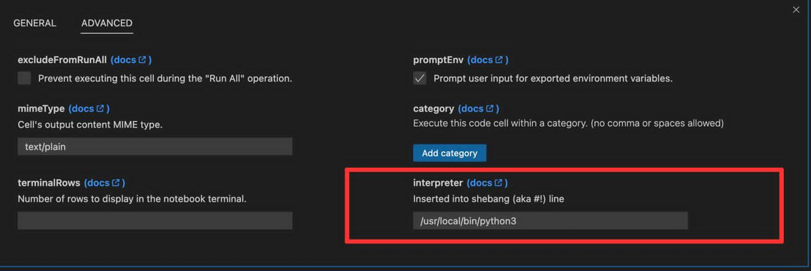

Shebang is a versatile tool designed to execute scripts written in various scripting languages including Shell, Perl, Python, and more. Runme integrates Shebang to enable users to run the script of their choice directly from the markdown file in their preferred programming language.

## Prerequisites

Before proceeding with the integration of Shebang in [Runme](https://docs.runme.dev/install#runme-cli), ensure that Runme is properly [installed](https://docs.runme.dev/install#runme-cli) on your system. This is a crucial step to guarantee the smooth execution of your runbooks

## Run your Code with Runme in VS Code Using Shebang

Runme gives you the power to run your code right inside your markdown file in VS Code without having to switch to a terminal. To do this, follow the steps below:

1. Click on the **+Code icon.**
2. Enter the script you would like to run.
3. Click on the **Select Cell Language Mode** and select a language of your choice.
4. Now click on **Execute Cell**

## Configuring Shebang Custom Interpreter in VS Code

Alternatively, if you would love to run your code using your specified interpreter version, you can achieve that using the custom interpreter feature. This allows you to configure the environment for running code directly within your editor, making your coding experience much smoother and easier.


Follow the steps below to set up the Shebang custom interpreter in VS Code:

1. Open your script (markdown file) in VS Code
2. Click on **Configure** menu at the buttom right of your code block
3. Click on **Advance**
4. Set the path to the system interpreter of your choice.



5. close the modular
6. Execute the Runme command:

```sh
# short for "runme tui" is
runme
```


## Examples of Shebang Lines for Different Languages

We have attached some scripts in various languages as seen below to enable you to test how Runme works in your VS Code.

Each of the following examples, written in Python, Ruby, Bash, and Node.js (JavaScript), accomplishes the same task: they define a greeting ("*Hello, World!*"), obtain the current date and time, and then combine these into a single message. The primary difference lies in the syntax and functions/methods used for date and time formatting in each language.

### Python

To run the Python code, you need to set the path to the Python interpreter, which is ***/usr/bin/python3***, in the advanced section of your configuration in your code block.

```python
import datetime

# Define a variable for the greeting
greeting = "Hello, World!"

# Get the current date and time
currentDateTime = datetime.datetime.now().strftime('%Y-%m-%d %H:%M:%S')

# Concatenate the greeting with the current date and time
fullGreeting = greeting + " It's now " + currentDateTime

# Output the full greeting
print(fullGreeting)
```

### Bash

To use Bash, you need to set the Interpreter to point to the Bash interpreter, which is ***/usr/bin/bash***, in the advanced section of your configuration in your code block.

```sh

# Define a variable for the greeting
greeting="Hello, World!"

# Get the current date and time
currentDateTime=$(date '+%Y-%m-%d %H:%M:%S')

# Concatenate the greeting with the current date and time
fullGreeting="$greeting It's now $currentDateTime"

# Output the full greeting
echo $fullGreeting
```

### Ruby

To use Ruby, you need to add the path to the Ruby interpreter, which is ***/usr/bin/ruby***, in the advanced section of your configuration in your code block.

```sh
# Define a variable for the greeting
greeting = "Hello, World!"

# Get the current date and time
currentDateTime = Time.now.strftime("%Y-%m-%d %H:%M:%S")

# Concatenate the greeting with the current date and time
fullGreeting = "#{greeting} It's now #{currentDateTime}"

# Output the full greeting
puts fullGreeting
```

### PHP

To use PHP, you need to add the path to the PHP interpreter, which is ***/usr/bin/php***, in the advanced section of your configuration in your code block..

```php { interpreter=/opt/homebrew/bin/php }
<?php
// PHP Script Example: Greeting with Date and Time

// Define a variable for the greeting
$greeting = "Hello, World!";

// Get the current date and time
$currentDateTime = date('Y-m-d H:i:s');

// Concatenate the greeting with the current date and time
$fullGreeting = $greeting . " It's now " . $currentDateTime;

// Output the full greeting
echo $fullGreeting;
?>
```

### Node

To use Node.js, you need to add the path to the node interpreter, which is ***/usr/bin/node***, in the advanced section of your configuration in your code block.

```sh
// Define a variable for the greeting
const greeting = "Hello, World!";

// Get the current date and time
const currentDateTime = new Date().toISOString().replace('T', ' ').substring(0, 19);

// Concatenate the greeting with the current date and time
const fullGreeting = `${greeting} It's now ${currentDateTime}`;

// Output the full greeting
console.log(fullGreeting);
```

## List of Auto-Detected Language Runtimes

Runme auto-detects runtimes based on the language selection per cell.

<table class="text-left">
  <thead>
    <tr>
      <th>Name</th>
      <th>LanguageIDs</th>
      <th>Runtime (first match wins)</th>
    </tr>
  </thead>
  <tbody>
    <tr>
      <td><a target="_blank" href="https://www.gnu.org/software/bash/">Bash Shell</a></td>
      <td>bash</td>
      <td>bash</td>
    </tr>
    <tr>
      <td>Windows <a href="https://learn.microsoft.com/en-us/windows-server/administration/windows-commands/cmd">cmd.exe</a></td>
      <td>cmd</td>
      <td>cmd</td>
    </tr>
    <tr>
      <td>Windows <a href="https://learn.microsoft.com/en-us/windows-server/administration/windows-commands/cmd">cmd.exe</a></td>
      <td>dos</td>
      <td>cmd</td>
    </tr>
    <tr>
      <td><a target="_blank" href="https://fishshell.com/">Fish Shell</a></td>
      <td>fish</td>
      <td>fish</td>
    </tr>
    <tr>
      <td><a target="_blank" href="https://en.wikipedia.org/wiki/JavaScript">Javascript</a></td>
      <td>javascript, js, jsx, javascriptreact</td>
      <td>node</td>
    </tr>
    <tr>
      <td><a target="_blank" href="http://kornshell.com/">Korn Shell</a></td>
      <td>ksh</td>
      <td>ksh</td>
    </tr>
    <tr>
      <td><a target="_blank" href="https://www.lua.org/">Lua</a></td>
      <td>lua</td>
      <td>lua</td>
    </tr>
    <tr>
      <td><a target="_blank" href="https://www.perl.org/">Perl</a></td>
      <td>perl</td>
      <td>perl</td>
    </tr>
    <tr>
      <td><a target="_blank" href="https://www.php.net/">PHP</a></td>
      <td>php</td>
      <td>php</td>
    </tr>
    <tr>
      <td><a target="_blank" href="https://learn.microsoft.com/en-us/powershell/scripting/overview">PowerShell</a></td>
      <td>powershell</td>
      <td>powershell</td>
    </tr>
    <tr>
      <td><a target="_blank" href="https://www.python.org/">Python</a></td>
      <td>python, py</td>
      <td>python3, python</td>
    </tr>
    <tr>
      <td><a target="_blank" href="https://www.ruby-lang.org/en/">Ruby</a></td>
      <td>ruby, rb</td>
      <td>ruby</td>
    </tr>
    <tr>
      <td><a target="_blank" href="https://en.wikipedia.org/wiki/Unix_shell">Unix Shell</a></td>
      <td>shell, sh</td>
      <td>bash, sh</td>
    </tr>
    <tr>
      <td><a target="_blank" href="https://www.typescriptlang.org/">Typescript</a></td>
      <td>typescript, ts, tsx, typescriptreact</td>
      <td>ts-node, deno, bun</td>
    </tr>
    <tr>
      <td><a target="_blank" href="https://www.zsh.org/">Z Shell</a></td>
      <td>zsh</td>
      <td>zsh</td>
    </tr>
  </tbody>
</table>

Missing a language? Please [raise an issue](https://github.com/stateful/runme/issues/new).

## Combining Multiple Languages in Your Notebook

It's possible to combine multiple languages in a single notebook by using different shebang lines for each script block. For an example of a notebook with multiple languages, see the [Shebang Notebooks example on GitHub](https://github.com/stateful/Shebang-Notebooks/blob/main/shebang-example.md).
