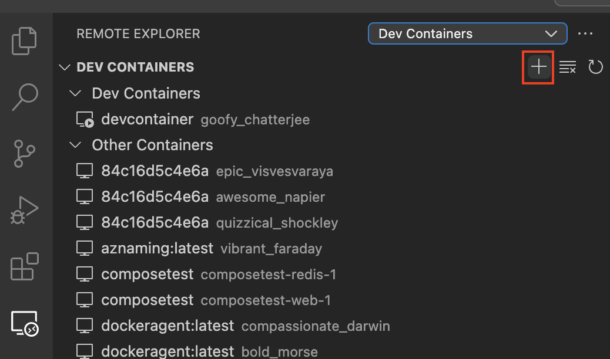

# ContainerCraft

In this guide, we'll drive a [ContainerCraft](https://containercraft.io/) development container with Runme. The ContainerCraft environment includes Runme, Kubernetes, Helm, Kubectl, K9s, Tmux, Python, Go, and more.

## Prerequisites

To get started, ensure you have the following installed on your local machine:

- Install [**Runme** for VS Code](https://marketplace.visualstudio.com/items?itemName=stateful.runme) and set it as your [default Markdown viewer](../installation/vscode#configure-your-default-markdown-editor).
- Ensure you have [**Docker** installed](https://www.docker.com/products/docker-desktop/) and running on your machine.
- Install the [**VS Code Remote—Containers** Extension](https://marketplace.visualstudio.com/items?itemName=ms-vscode-remote.remote-containers) to work with containers directly.

## Setting Up Your Development Container

Create a folder to contain the dockerfile and `devcontainer.json` at the end of this guide. Use this command inside of your README to create it:

```bash {"id":"01J6YWZ6PHZM16VX6EE3JYY98Y"}
mkdir -p ./.devcontainer
```

### Create and configure the `devcontainer.json`

The `devcontainer.json` file specifies how VSCode should handle the container. In your `README.md` file, run the script below. This will create the `devcontainer.json` and give it the ContainerCraft configuration.

```bash {"id":"01J7GC2HFGJXB58KQZ6M1VVJ15"}


cat <<EOF | sudo tee ./.devcontainer/devcontainer.json > /dev/null
{
    "name": "konductor",
    "remoteUser": "vscode",
    "dockerFile": "Dockerfile",
    "init": true,
    "privileged": true,
    "overrideCommand": false,
    "updateRemoteUserUID": true,
    "shutdownAction": "stopContainer",
    "securityOpt": [
        "seccomp=unconfined"
    ],
    "runArgs": [
        "--privileged",
        "--network=host",
        "--device=/dev/kvm"
    ],
    "mounts": [
        "source=dind-var-lib-docker,target=/var/lib/docker,type=volume"
    ],
    "features": {
        "ghcr.io/devcontainers/features/docker-outside-of-docker:1": {}
    },
    "postCreateCommand": "devcontainer-links",
    "forwardPorts": [
        1313,
        2222,
        6000,
        7681,
        8080
    ],
    "customizations": {
        "vscode": {
            "extensions": [
                "golang.go",
                "vscodevim.vim",
                "github.copilot",
                "stateful.runme",
                "max-ss.cyberpunk",
                "ms-python.python",
                "redhat.vscode-yaml",
                "esbenp.prettier-vscode",
                "oderwat.indent-rainbow",
                "okteto.kubernetes-context",
                "ms-vsliveshare.vsliveshare",
                "ms-azuretools.vscode-docker",
                "github.vscode-github-actions",
                "ms-kubernetes-tools.kind-vscode",
                "ms-vscode.vscode-typescript-next",
                "github.vscode-pull-request-github",
                "ms-vscode-remote.remote-containers",
                "randomfractalsinc.vscode-data-table",
                "visualstudioexptteam.vscodeintellicode",
                "ms-kubernetes-tools.vscode-kubernetes-tools"
            ]
        }
    }
}
EOF
```

### Create and configure the `Dockerfile`

The `Dockerfile` defines the base image for the development container, which is the foundation for setting up the development environment. In your `README.md` file, run the script below.

```bash {"id":"01J7GC7RQ5QRM437CJS3TCPW8B"}
cat <<EOF | sudo tee ./.devcontainer/Dockerfile > /dev/null
FROM ghcr.io/containercraft/devcontainer:latest
EOF
```

This will create a Dockerfile with the ContainerCraft image in it.

## Access your project in the development container

Now that you have set up your development container, you need to access your project in the development container. To do this, follow the steps below:

1. Press `Ctrl+Shift+P` (or `Cmd+Shift+P` on Mac) to open the command palette. Then, search for `Remote-Explorer: Focus on Dev Containers`.


2. Now, click the `+` icon to select your project directory. If you’ve created the development container before now, you don’t need to click the `+` icon. Just selecting the container from the available list populated on the screen is enough.



## Rebuild and open the container

After selecting the folder where your project is, VS Code should prompt you to reopen the folder in a container.

If that does not happen, open the command palette (`Ctrl + Shift + P`) and select `Remote-Explorer: Focus on Dev Containers`. This will allow VS Code to build the Docker image defined in the `.devcontainer` folder and open the workspace inside the container once the build is complete.


## Test your project inside the development container

Use your DevOps tools directly within the VS Code terminal inside the container (Runme, Kubernetes, Helm, Kubectl, K9s, Tmux, Python, Go, and more)...

<video autoPlay loop muted playsInline controls>
  <source src="/videos/runme-devcontainer-hello.mp4" type="video/mp4" />
  <source src="../../static/videos/runme-devcontainer-hello.mp4" type="video/mp4" />
  <source src="/videos/runme-devcontainer-hello.webm" type="video/webm" />
  <source src="../../static/videos/runme-devcontainer-hello.webm" type="video/webm" />
</video>
<br/>

## Runme features

With Runme in your development container, you can build projects in any programming language. This is made possible with the [Shebang support feature](../usage/shebang). It allows you to easily set the code block of the specific programming language you intend to use. You can also add and run the different supported languages in one Markdown file.

Here is an example of a simple Python project showcasing how the Runme Shebang feature enables you to execute commands and scripts in a development container.

<video autoPlay loop muted playsInline controls>
  <source src="/videos/Runme-python-dev-container.mp4" type="video/mp4" />
  <source src="../../static/videos/Runme-python-dev-container.mp4" type="video/mp4" />
  <source src="/videos/Runme-python-dev-container.webm" type="video/webm" />
  <source src="../../static/videos/Runme-python-dev-container.webm" type="video/webm" />
</video>
<br/>

In addition, you can set your code block to run a command(s) in the background while you focus on other aspects of your project using the [background task feature](https://docs.runme.dev/how-runme-works/vscode#background-processes).

Below is an example video that illustrates how the background task feature works with your Go projects in a development container.

<video autoPlay loop muted playsInline controls>
  <source src="/videos/go-runme-dev-container.mp4" type="video/mp4" />
  <source src="../../static/videos/go-runme-dev-container.mp4" type="video/mp4" />
  <source src="/videos/go-runme-dev-container.webm" type="video/webm" />
  <source src="../../static/videos/go-runme-dev-container.webm" type="video/webm" />
</video>
<br/>

Here is also an example of a project on [how to handle large data efficiently with Node.js streams](https://github.com/stateful/blog-examples/tree/main/node-streams).

<video autoPlay loop muted playsInline controls>
  <source src="/videos/runme-node.mp4" type="video/mp4" />
  <source src="../../static/videos/runme-node.mp4" type="video/mp4" />
  <source src="/videos/runme-node.webm" type="video/webm" />
  <source src="../../static/videos/runme-node.webm" type="video/webm" />
</video>
<br/>

## Shutting down the container

After completing the task, you can shut down the container by closing the VS Code, which automatically stops the container. However, your project files and changes will persist on your local machine.

## Additional Resources

To learn more about using Development Containers with Runme, see more resources below:

- [Running Runme in a Development Container](../usage/devcontainers)
- [How to Integrate Python Virtual Environments with Runme](../guide/pythonenv)
- [Developing Inside Container](https://code.visualstudio.com/docs/devcontainers/containers)
